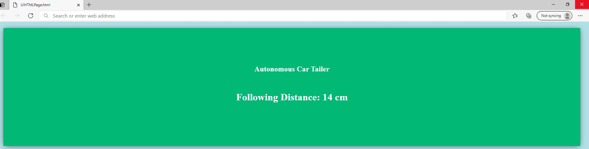

# Senior-Capstone-Project

## **Project ACT (Autonomous Car Tailer)**

### **2021 Senior Capstone Project**
<figure>

<figcaption style="text-align: center"><h3>Modified EELE101 Arduino Car</h3></figcaption>
</figure>
EELE 101 is a class designed to introduce electrical concepts that enable students to explore the endless possibilities of technology. The core principle of the EELE 101 class is to have the students build, program, and test an Arduino Uno car. The Arduino Uno car is a perfect project for students interested in electrical engineering because it requires little coding experience and allows students to see the capabilities of robotics.  By introducing a simple, yet challenging design of an Arduino Uno car, students can become more familiar with electrical engineering.  Modifications of the EELE 101 car could be made to demonstrate even more advanced capabilities of current technology.

The EELE 101 car was modified to join and follow a train of one or more vehicles from its initial position on the side of a track, while maintaining a safe following distance.  This will provide students enrolled in the EELE 101 course the option to explore advanced capabilities of the car.

<figure>

<figcaption style="text-align: center"><h3>EELE101 Track</h3></figcaption>
</figure>

<figure>

<figcaption style="text-align: center"><h3>Placement of a  modified EELE101 car</h3></figcaption>
</figure>

The flow chart for the system is displayed below and the logical steps for the car’s functionality are emphasized. When the ultrasonic distance sensor detects an object within 30 cm, a signal is sent to the Arduino Uno to begin moving the servo motors at the same speed. As the car moves from the side of the track, it continues straight until the QTI sensors detect the black line, at which point the car adjusts its position to follow the line. The QTI sensors constantly check for the black line to keep the car on track. At the same time, the ultrasonic sensor measures the distance from the modified vehicle to the in front of it and transmits that measured distance to the wireless communication module. If the measured distance is between 13 and 15 cm, the servo motor speed is decreased. If the distance is above 17 cm, the servo motor speed is increased. Meanwhile, the user interface website is initialized with no measured distance. It checks for data transmitted from the ESP32, and when it receives data, the website is updated with the measured distance for the user to view.

<figure>

<figcaption style="text-align: center">Entire System Flowchart</figcaption>

</figure>

The User Interface is a website hosted onto ESP32 and updates as soon as the modified EELE101 joins the train of cars. AJAX is used to constantly update the recorded following distance. It can viewed by connecting to ESP32 Wi-Fi Access Point and browsing the host of the website.

<figure>

<figcaption style="text-align: center">User Interface showing the current following distance</figcaption>
</figure>

## **Capstone Team:**
* Ronnel Walton
* Brent Bergman
* Nikki Sabiers
* Dee Vang